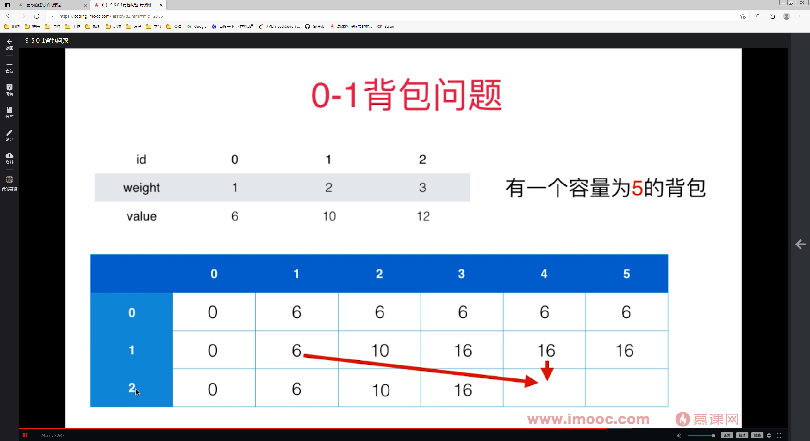

# 什么是动态规划
1. 自底向上的思考方式
2. 将原问题拆成若干个子问题
3. 分别计算子问题的答案并保存，保证每个子问题只计算一次
4. 聚合子问题的答案得到原问题答案

```java
// 动态规划实现斐波那契数列
int[] memo = new int[n];
memo[0] = 0;
memo[1] = 1;
for(int i=2; i<n; i++) {
  memo[i] = memo[i-2] + memo[i-1];
}
```

# 0-1 背包问题
有一个容量为C的背包，将n个物品放入（对应0~n-1），每个物品重量是w(i)，价值是v(i)。  
求：怎么放可以让背包中的物品价值最大？
```JAVA
// 状态转移方程
// 通常，全局参数就是问题的限制条件，即将n个物品放入容量为C的背包中。 即 F(n, C)
// 第i个物品对应的价值为 F(i, C)
// 第i个物品有2种状态：1）放入； 2）不放入
// 放入： v(i) + F(i-1, C-w(i))
// 不放入： F(i-1, C)
// 状态转移方程就是求二者的最大值，即：F(i, C) = MAX[F(i-1, C), v(i)+F(i-1, C-w(i))]
```
